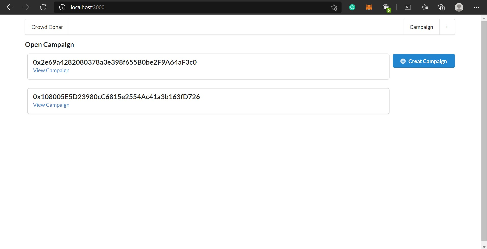
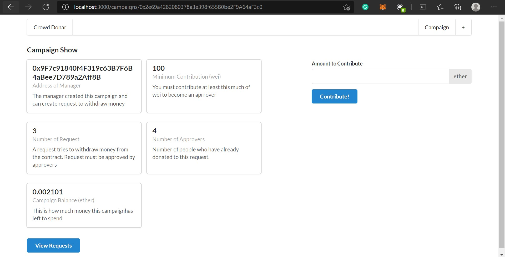
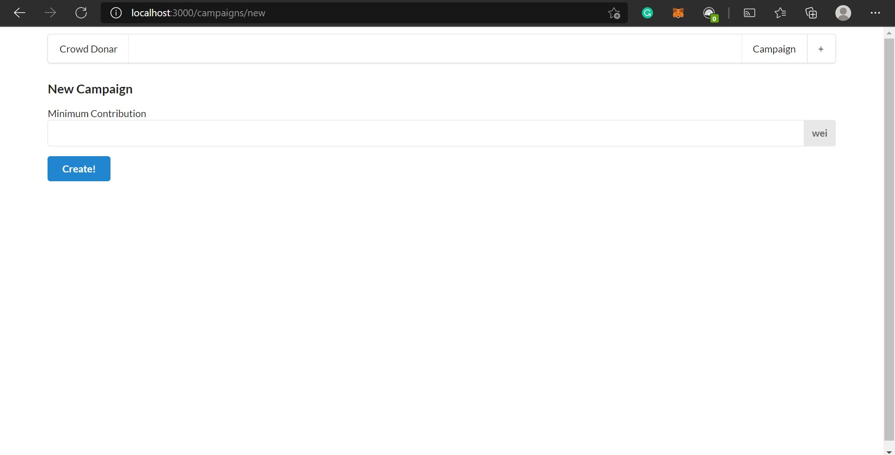
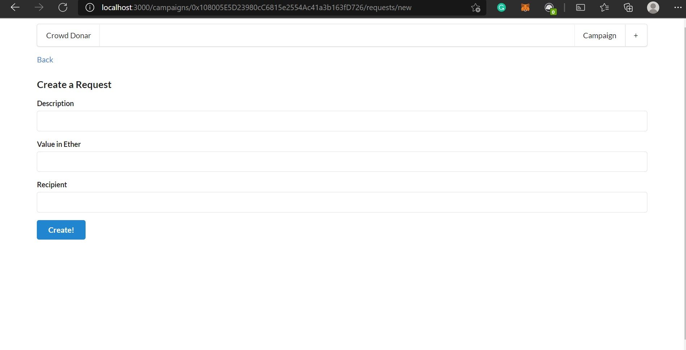
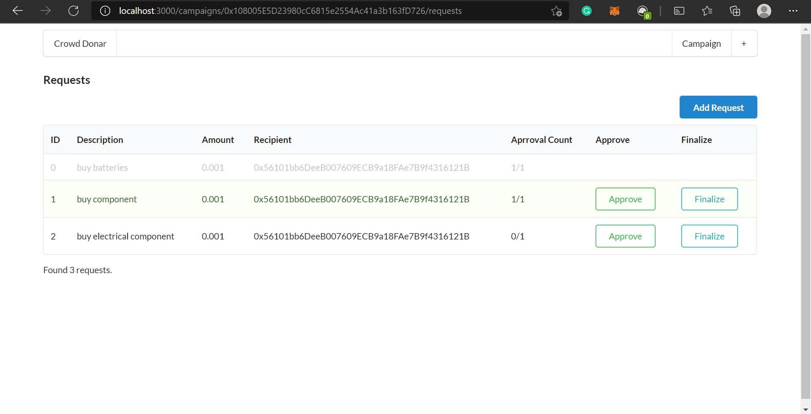

# Crowd-Donar
## The Problem
To Increase Transparency and Prevent Fraudulent Activities that arise around the world of StartUps ,Donation Platform  that have till now been developed around it such as <a href="https://www.kickstarter.com/">KickStarter</a>. Although stringent measures such as symmetric encryption are in place to make e-payment safe and secure, it is still vulnerable to hacking. Enterprises with in-house e-payment systems must incur additional costs in procuring, installing and maintaining sophisticated payment-security technologies. There is no guarantee that people who post projects on Kickstarter will deliver on their projects, use the money to implement their projects, or that the completed projects will meet backers' expectations, and same goes with some of the donation websites. A mockup of KickStarter built using smart contracts written in solidity. The app is built using Reactjs with the help of Nextjs.

## What We Propose
Making transaction histories more transparent and secure through the use of **blockchain technology** . Because Blockchain is a type of distributed ledger, all network participants share the same documentation as opposed to individual copies. Contributors can decide Where to invest and can Acknowledge the requests for money made by the Project Creators through their votes.The creator can only use the money if a minimum number of contributors approve a certain request. It will make sure the money is used for Necessities rather than Luxuries.

## Technology Stack
- **ReactJs**
- **Solidity**
- **Ethereum Smart Contract**
- **Node.js**
## Demo Shots
_Home Page_

_Campaign Details_

_Create Campaign_

_Create Request_

_Request_

## Features
### Secure Investment
Information is stored across a network of computers instead of on a single server, makes it very difficult for hackers to compromise the transaction data.
### Voting Power for Investors
The creator can only use the money if a minimum number of contributors approve a certain request. It will make sure the money is used for Necessities rather than Luxuries.
### Profit Distribution
The owner of the startup is required to periodically enter details about revenue generation. Any profit that is generated is automatically distributed among the investors providing investors with additional layer of security of interests of investors.
